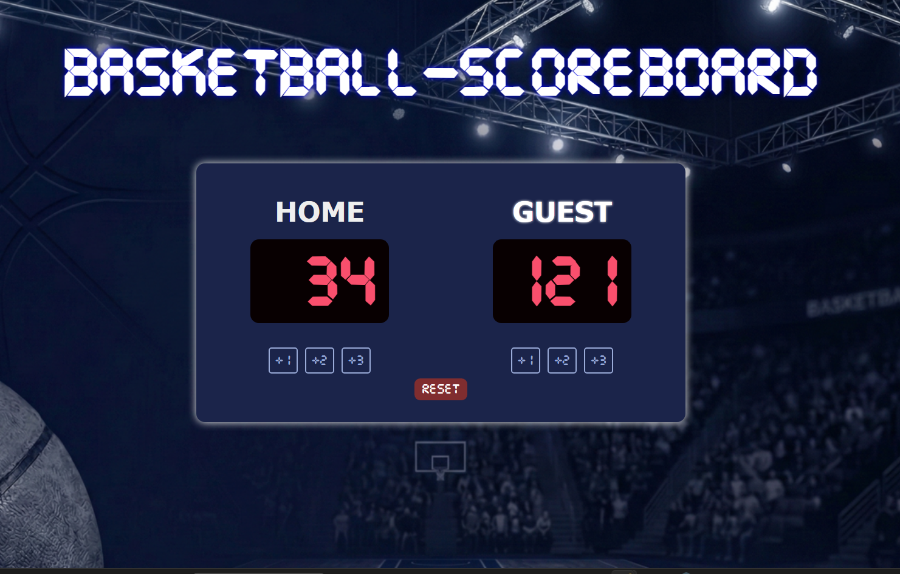

## #Basketball Scoreboard

A fully responsive, interactive basketball scoreboard built with vanilla web technologies. This project simulates a real-life digital arena scoreboard with point tracking, neon highlight effects for the winning team, and a retro digital aesthetic.

 

## 🚀 Live Demo
[Click here to view the live project](https://emjotka05.github.io/basketball-scoreboard-web/)

## ✨ Features
* **Interactive Scoring:** Buttons to add +1, +2, or +3 points for both HOME and GUEST teams.
* **Dynamic Highlight:** The scoreboard automatically detects the winning team and highlights their name with a neon text-shadow effect.
* **Responsive Design:** Fully adapts to mobile screens single-column layout and desktop monitors two-column layout using CSS Media Queries.
* **Accessible (a11y):** Implemented `aria-label` attributes for screen reader support, ensuring the app is usable by visually impaired users.
* **Custom Typography:** Uses a custom digital `.ttf` font to mimic authentic LED sports displays.

## 🛠️ Built With
* **HTML5:** Semantic structure and accessibility.
* **CSS3:** Flexbox layout, custom `@font-face`, media queries and hover/transition animations.
* **JavaScript:** DOM manipulation, state management - score tracking and dynamic styling.
* **Figma:** UI/UX design and layout planning. [View the original Figma design](https://www.figma.com/design/r6sq4w33E8i9BYDnbyLC4T/Basketball-Scoreboard?node-id=192313-76&t=jo5Epe8W1oQ2kiJ6-1)

